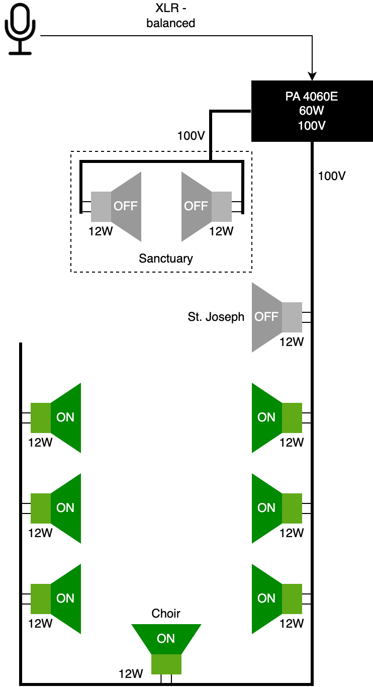
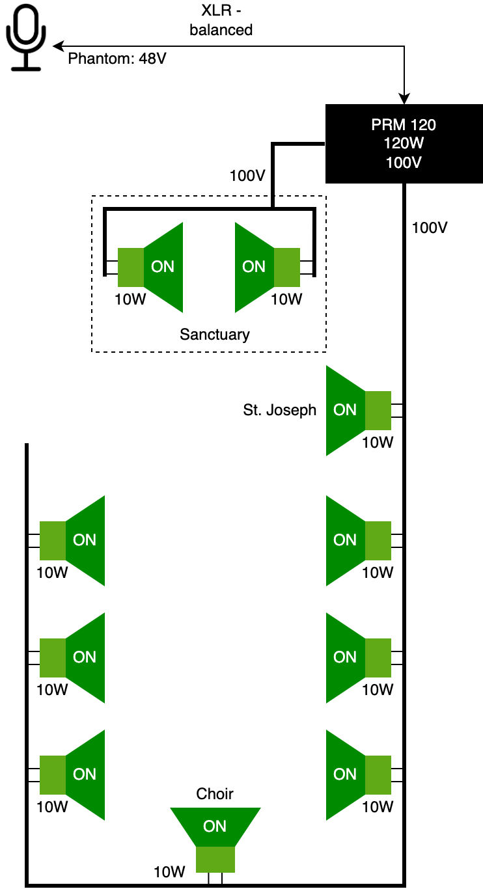

## Current Installation

The system we have is a [100V system](https://www.monacor.com/magazine/100-v-speakers). It is convenient: speakers can be added/removed without impacting the whole installation as long as the maximum output power of the amplifier is respected (for voice-only applications, it is recommended that the combined load of all the loudspeakers is less than 90% of the maximum output power of the amplifier).

The drawing below shows the overview of our current installation.

  

<b>Figure 1</b> Current Installation

The components we currently use are described below:
Prefer-MPR-85.pdf
| Component | Description |
|---|---|
| Microphone | **Prefer MPR-85** *Fixed-charge back plate, permanently polarized condenser* **Output:** XLR balanced **Battery:** 1.5V AA [User Manual](/pdf/Prefer-MPR-85.pdf) |
| Amplifier | **Eagle PA4060E** **Power output:** 60W [User Manual](/pdf/PA4000-Series.pdf) |
| Speakers | **Philips EL 7163/00** *70V/100V Speakers, 12W* **Cable color code:** blue: 70V, brown: 100V, black: common |

From the above description, we see that the existing configuration with 7 active loudspeakers exceeds the output power of the amplifier (output power is 60W, the combined power of all speakers is 84W).

## A bit of theory

The 100V installation is different from what most of us experienced at home with the common 4Ω/8Ω setup, also called a *low impedance system*. In low impedance systems, it is crucial that the impedance of the speakers match precisely the output impedance of the amplifier. When the impedance of the speakers is higher than the output impedance of the amplifier, the result is a mismatch and some power will be lost. When the impedance of the speakers is lower than the output impedance of the amplifier, we will also have a mismatch, but more importantly, we overload the amplifier and risk damaging it. For the power of the speakers, it is common and even recommended that the maximum supported power of the speakers is considerably higher than the maximum output power of the amplifier (can be even 2-3 times higher). The actual power provided to the speakers is set by the user via an *output volume* knob (or an equivalent control).

In the 100V installation things are different. There is no output volume knob (or any other control) on the amplifier. If an amplifier has a mixer (our amplifier has), one can adjust the amplification of each single input, but it will have no impact on the actual power that goes out from the speakers. The mixer is meant to provide the correct or intended balance between various input sources; increasing the amplification of the selected input too much will most certainly result in distortion (bad quality) in the output signal, not so much in the output power of the whole setup.

So how do we control the output power in a 100V installation? By setting the correct power on the speakers themselves. Thus, the output power of the 100V-compatible speaker determines the actual output power being emitted. Some speakers provide functionality to select the output power of the speaker. For instance, a 20W speaker, may have a switch or multiple cable connections (so called *power tappings*) allowing to select a lower power: for instance 5W or 10W. The speakers we currently have, Philips EL 7163/00, have only one available output tapping: 12W. It means, they always emit exactly this output power. Now, while in low impedance speaker setup we had to assure that there is a match between the output impedance of the amplifier and the input impedance of the speakers while at the same we did not have to worry about the maximum allowed output power of the speakers (as long as it is higher than what we want to output), in a 100V setup we do not have to worry much about the impedance matching, but we have to be more careful about the power.

In a 100V installation, the speakers are connected in parallel. In a low impedance system, connecting two speakers in parallel will lower the resulting input impedance of the setup (e.g. for two 8Ω speakers connected in parallel, the resulting input impedance will be 4Ω). Connecting two low impedance speakers serially will increase the resulting impedance (two 8Ω speaker connected serially will have 16Ω of the resulting impedance). Thus, in low impedance systems, the number of speakers connected together is usually limited, and not really used in practice (we usually connect one matching speaker to one output of the amplifier). This is not the case in 100V installations, where we can connect many speakers in parallel without causing any troubles: it is like each speaker has a very high impedance and thus half of something that is very big, is still very big (think of infinity). For this reason, 100V installations are often called *high impedance* systems.

We said, that in 100V installations or a high impedance system, one needs to be careful about the output power. The rule is simple: the sum of the powers of all the speakers connected in parallel needs to be lower than the maximum output power of the amplifier (for purely voice applications the combined output power of the speakers should not exceed 90% of the maximum output power of the amplifier).

> Exceeding the maximum output power of the amplifier usually leads to a damage of both the amplifier and the speaker(s).

> In the original installation that we had in our church, we had 10 speakers of 14W each connected to a 60W amplifier. This means that we exceeded the maximum output power of the amplifier more than twice (140W of combined power of the speakers vs 60W of the amplifier). It is thus hard to say in which functional state is the amplifier and each of the speakers...

## Suggested installation

In order to make the installation more robust and flexible, I would recommend maintaining the current 100V setup, but to upgrade the components.

We may like to consider adding 2 speaker behind the altar. The speakers that are currently there need to be moved to the sides a bit as currently they are completely covered by the altar. We may also consider restoring the currently disconnected speakers vis-á-vis the St. Joseph.

> The speakers behind the altar and at the St. Joseph's are currently disconnected in order to limit the already exceeded capacity of the amplifier.

Thus, in the new proposed setup we would have 10 speakers in total. The speakers that I suggest as a replacement for the current speakers can be configured as either 5W, 10W, or 20W.

The diagram below shows the proposed setup.

  

<b>Figure 2</b> Suggested Installation

I expect that 10W is sufficient for each speaker in our installation. Currently we use 12W per speaker, but we can't really say in which functional state is the amplifier and the speakers themselves taken that the principle of not exceeding the maximum output power of the amplifier was not respected. As a consequence, some of the speakers may not be fully functional and we can't really say anything about the condition of the amplifier.

Because the proposed speakers have three output power tappings, we may still decide to locally increase the output power to 20W. I do not expect this, however, to be needed, taken the small cubature of our church. I expect on the contrary, that we may be able to further decrease the output power of some speakers to 5W (e.g. in the choir or maybe also for some speakers on the main floor).

Thus, for 10 speakers, each set to 10W output, we need 100W from the amplifier. The proposed amplifier provides 120W, which is then sufficient for the proposed installation. Unfortunately, there are no amplifiers with 140W or 160W, the next one available will most probably be 240W or more. While we still may consider this option and really not worry about the future, it might turn out to be an overkill, resulting in unnecessary increase of the cost of the amplifier. I think 120W, is a solid and sufficient setup for our church, and if more is needed: the cost of the 120W amplifier is very moderate and we could still sell it to finance a more expensive one in the future.

Thanks to the flexibility of the 100V installation, the upgrade can be performed in steps. The best way is to first upgrade the amplifier, then the speakers (best all at once or in few stages but without waiting too long between them in order to avoid supply problems or product discontinuity), and only then upgrade the microphone setup.

## Amplifier and Speakers

This is the most affordable selection that should be sufficient for our needs. The amplifier has 2 XLR balanced microphone inputs plus 2 unbalanced microphone/line inputs (6.3mm (1⁄4”) input jack) and two RCA line inputs. There is also an RCA line output and phantom power (24V, see the note below) for XLR microphone inputs. The output power of 120W should be enough to power 11 speaker of 10W. This amplifier has one zone.

> The Power Dynamic amplifiers provide optional *phantom power* to the XLR inputs. In the PRM120 amplifier shown below this is 24V, for other amplifiers it is sometimes 12V. Unfortunately, lots of modern condenser microphones require 48V of phantom power. Thus, for a more reliable solution, it is better to use an external Phantom Power supplier as for example [Millenium PP2B Phantom Power Supply](https://www.thomann.de/nl/millenium_pp2b.htm?gclid=EAIaIQobChMIu7CYwdqQ_wIVWvJ3Ch0mygxLEAQYASABEgIpXfD_BwE) (€32, 24-May-2023).

| Component | Description |
|---|---|
| Amplifier | **Power Dynamics PRM120 100V** **Power output:** 120W [Product Description](https://www.tronios.com/prm120-100v-6-ch-mixer-amplifier-120w/) [User Manual](/pdf/PRM120.pdf) **Buy:** [€254, 24-May-2023](https://www.bax-shop.nl/100-volt-versterker-mixer/power-dynamics-prm120-100v-4-8-ohm-19-inch-versterker-120-watt) |
| Speakers | **Power Dynamics ICS4 100V 20W** *100V Speakers* **Available power tappings:** 5W, 10W, 20W [User Manual](/pdf/Speakers20W.pdf) **Buy:** [€49, 24-May-2023, price per unit](https://www.bax-shop.nl/100v-zuil-luidspreker/power-dynamics-ics4-100v-20-watt-zuilluidspreker-wit) |

## Microphone and other materials

Here are some examples of good quality, yet affordable microphones specially meant for churches or public announcement setups. The list also includes other elements that may need to be considered. As said, this is the last step of the upgrade and it does not affect the overal installation (which means it is flexible and can be changed regardless of the choice of the amplifier and speakers above). 

| Component | Description |
|---|---|
| Microphone | **Audio-Technica PRO49QL** *Cardioid Condenser Quick-Mount Gooseneck Microphone* **Output:** XLR balanced **Phantom power:** 48V [Product Description](https://www.audio-technica.com/nl-nl/microphones/wired/best-for/podium-lecturn/pro49q) **Buy**: [€139, 24-May-2023](https://www.thomann.de/nl/audio_technica_pro_49_ql_schwanenhalsmikrofon.htm) |
| Microphone | **Audio-Technica U857Q** *Cardioid Condenser Quick-Mount Gooseneck Microphone* **Output:** XLR balanced **Phantom power:** 48V [Product Description](https://www.audio-technica.com/nl-nl/microphones/wired/best-for/podium-lecturn/u857q) **Buy:** [€249, 24-May-2023](https://www.thomann.de/nl/audio_technica_u857q.htm) |
| Mount-plate | **AT8647QM/S** *Microphone Shock-mount Plate with Mute Switch* [Product Description](https://www.audio-technica.com/nl-nl/at8647qm-s?gclid=CjwKCAjw67ajBhAVEiwA2g_jEIBs6lpyXsY0_I4tprShd88NJp96Ufyw1zWTeVJY6BhxtxrlrOKaTBoCEacQAvD_BwE) [Datasheet](/pdf/AT8646-Specification-Sheet.pdf) **Buy:** [€110, 24-May-2023](https://www.audio-technica.com/nl-nl/at8647qm-s?gclid=CjwKCAjw67ajBhAVEiwA2g_jEIBs6lpyXsY0_I4tprShd88NJp96Ufyw1zWTeVJY6BhxtxrlrOKaTBoCEacQAvD_BwE) |
| Shock Mount | **AT8662** *Quick-mount Microphone Shock Mount* [Product Description](https://www.audio-technica.com/nl-nl/at8662) [Datasheet](/pdf/AT8662-Installation-Guide.pdf) **Buy:** [€38, 24-May-2023](https://www.thomann.de/nl/audio_technica_at_8662.htm) |
| XLR Socket | **Neutrik NC3 FD-L-B-1** *XLR Inbouwkoppeling* **Buy:** [€6.50, 24-May-2023](https://www.thomann.de/nl/neutrik_nc3fdl1b.htm) |
| Inline Microphone Switch | **JTS MA-SW** *Inline-microfoonschakelaar* **Buy:** [€23.90, 24-May-2023](https://www.thomann.de/nl/jts_ma_sw.htm?gclid=EAIaIQobChMIzLSqjcSO_wIVGs13Ch2ATgh_EAQYDCABEgJdEfD_BwE) |
| Microphone Stand | **the t.bone Table Stand** *Tafelvoet voor microfoon* **Buy:** [€35, 24-May-2023](https://www.thomann.de/nl/the_tbone_tischfuss.htm) |
| Microphone Station | **Sirus Desktop Microphone Station** *Microphone-Desktop Station with Anti-Shock Microphone Connection* **Buy:** [€66, 24-May-2023](https://www.thomann.de/nl/sirus_desktop_microphone_station.htm) |

## Cables

For connecting the speakers we are using [a standard electricity cable (2x0,75 mm²)](https://www.hornbach.nl/p/huishoudkabel-vmvs-2x0-75-mm-wit-per-meter/10253053/). I have already replaced part of the wiring to improve the current installation. Some more replacements will be needed when installing new speakers.

I have already replaced the old unbalanced microphone cable with the balanced XLR [pro snake TPM 20,0 CC Micro Cable](https://www.thomann.de/nl/pro_snake_tpm_200_cc_micro_cable_deepbl.htm).
